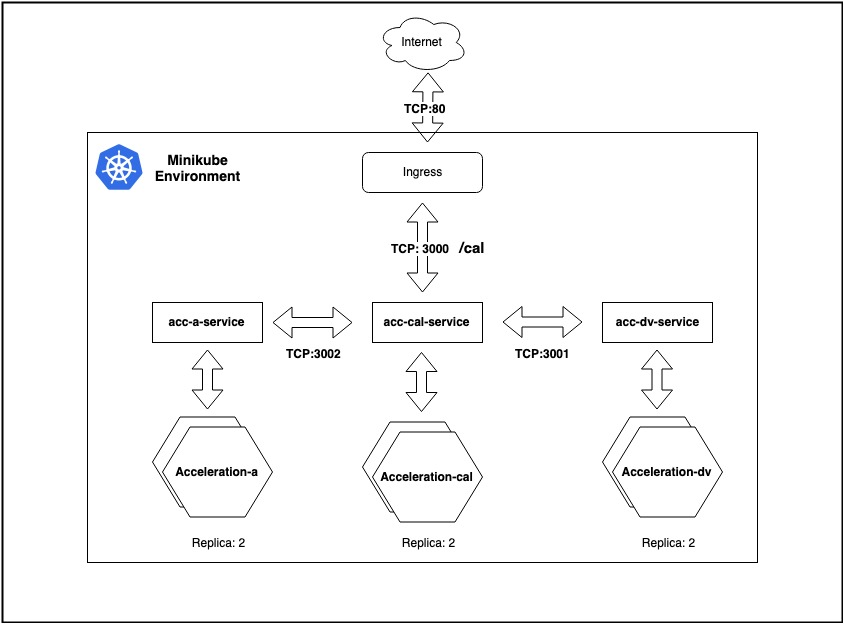

# Solution:

Architecture Diagram:



This solution tested successfully on Minikube
```bash
minikube version: v1.27.1
```
Steps:

1. Prerequisite

- Minikube Installed on the system (Tested on : v1.27.1).
- Helm Client Installed on the system (Tested on : v3.10.1).

2. Run the script run_helm_code.sh
```bash
./run_helm_code.sh
```

 **Browse : minikube-ip/calc?vf=200&vi=5&t=123 for the result** 


4.[Success]: Acceleration App Deployed


[Success]: Browse http://192.168.59.100/calc?vf=200&vi=5&t=123


